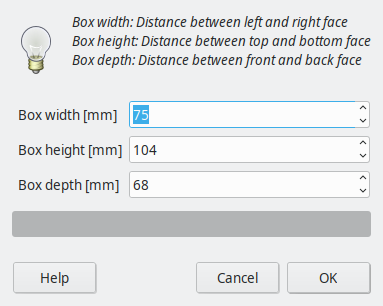
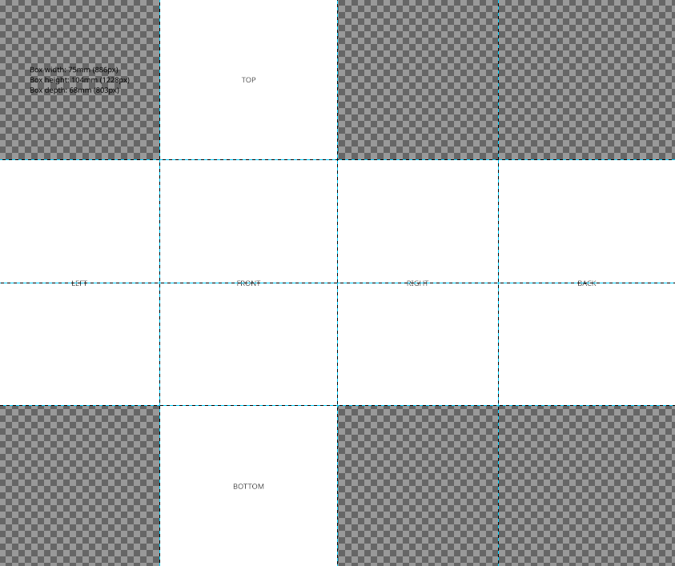
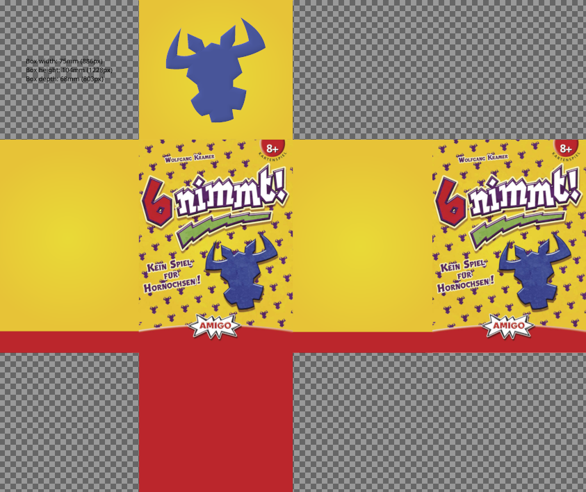
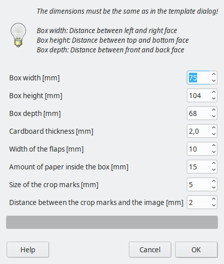
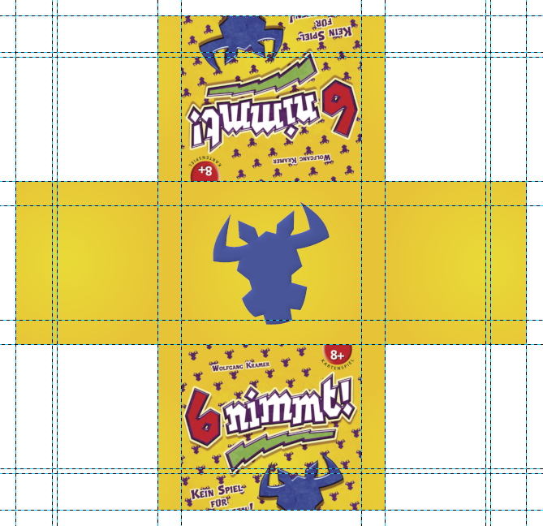
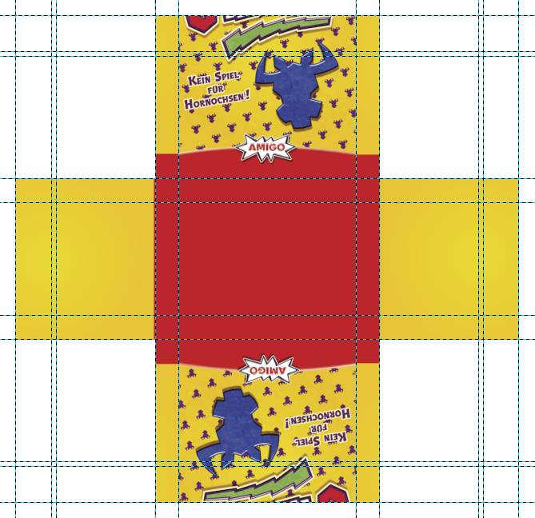

# Boxwrap plug-in for GIMP

This is a plug-in for GIMP that helps creating printable box wraps for
board games.  The manual process of creating a custom wrapped box for
board games is described in the excellent [tutorial by Pixelart Meeple
on BoardGameGeek](https://boardgamegeek.com/article/31765488).  This
plug-in automates some parts of the process.

## Installation

First make sure that your GIMP version supports Python plug-ins.  If
you use GIMP for Windows you should be fine.  If you use GIMP for
Linux you might have to install an additional package to enable Python
support for GIMP.  I had to install gimp-python on Ubuntu 19.10.

Next locate your GIMP plug-in folder.  In GIMP's menu bar click on
Edit/Preferences and then on Folders/Plug-ins.  This shows you all
folders where GIMP looks for plug-ins.

Finally copy the file boxwrap.py to any of you plug-in folders and
restart GIMP.  The plug-in should show up in the menu as
Filters/Boardgames/Box Wrap.

## Usage

Creating the printable box wrap is a two step process.  In the first
step you will create an unwrapped version of the box wrap.  In the
second step the plug-in will create two printable versions of the box
wrap, one for the top part of the box and one for the bottom part.

### Step 1: Creating a template

Click on Filters/Boardgames/Box Wrap/Create empty template...  This
will open a dialog where you can enter the physical dimensions of the
box.

Enter the box dimensions and press OK.  The plug-in will now create a
new template image for the unwrapped box with 300 dpi resolution.

The templates consists of one white rectangle for each side of the
box.  The rectangles are labeled TOP, LEFT, FRONT, RIGHT, BACK, and
BOTTOM.  In the top left corner of the template you can see the
physical dimensions of the box.  You will need these later in step 2.
There are several guides that mark the edges and the equator of the
box.

Fill in the graphics however you like.  You can add or remove any
number of guides and layers.  Only the size of the image must remain
the same.

This is an example of a filled in template ready for step 2.

### Step 2: Creating the printable wrap

Click on Filters/Boardgames/Create wraps from template...  This will
open a dialog where you can enter the physical dimensions of the box
(again), the thickness of the material that your box is made of, and a
few other parameters.  The dimensions must be exactly the same as in
step 1.

Enter the box dimensions and the cardboard thickness and press OK.
The plug-in will now create two images, one for the upper part of the
box and one for the lower part.

If nothing happens you probably have entered the wrong box dimensions.
You can click in the menu on Windows/Dockable Dialogs/Error Console to
open the GIMP error console.  This should should show an error
explaining what went wrong, for example

    Template image has the wrong size.
	Expected 4134px x 3602px (350mm x 304mm) 
	but got 4134px x 3590px (350mm x 303mm).

You should now have two new images that are ready for printing.  Note
that the flaps that wrap around the edges of the box were created by
the plug-in.

There are several guides which indicate the interesting parts of the
wrap including the flaps, the edges of the cardboard, and the parts
that are on the inside of the box.

There are also marks for cutting and folding.  These are covered by
the guides so you have to hide those to see the marks.  Click in the
menu on View/Show Guides or press Ctrl-Shift-T.

